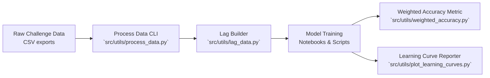

# Elmy Predictive Solar Maintenance

Forecast short-term electricity prices and asset conditions to support data-driven preventive actions on solar farms. This refreshed release highlights modern tooling, visuals, and reproducible workflows to make a strong impression during technical conversations with energy-focused recruiters.

## Visual Pipeline


## Repository Map
```
.
├── src/utils/            # Production-ready tooling for ETL, features & scoring
├── notebooks/            # Exploratory studies and model comparisons (archived)
├── tests/                # pytest suite covering critical utilities
├── docs/media/           # Visual assets referenced in presentations
├── requirements.txt      # Version-pinned dependencies for easy setup
└── AGENTS.md             # Contributor guidance for collaborators & agents
```

## Quickstart
1. Create an isolated environment  
   `python -m venv env && source env/bin/activate`
2. Install dependencies  
   `pip install -r requirements.txt`
3. Retrieve the ENS Challenge dataset and store raw files under `data/raw/`.
4. Process and engineer features:
   - Clean + scale data:  
     `python src/utils/process_data.py --input data/raw/elmy.csv --output data/interim/clean.csv --scaler standard`
   - Build lagged features:  
     `python src/utils/lag_data.py --input data/interim/clean.csv --target-column price_delta --n-lags 24 --output-features data/interim/lagged.csv --output-target data/interim/target.csv`
5. Train notebooks or scripts and visualise learning dynamics:  
   `python src/utils/plot_learning_curves.py --model models/xgb.joblib --train data/interim/lagged_train.csv --validation data/interim/lagged_val.csv --target-column price_delta`

## Core Utilities at a Glance
| Module | What it does | Example |
| --- | --- | --- |
| `process_data.py` | Column pruning, NA imputation, scaling & CLI export | `ProcessConfig(scaler="standard")` |
| `lag_data.py` | Structured lag generation for horizon tuning | `LagConfig(n_lags=24)` |
| `weighted_accuracy.py` | Challenge-compliant custom scorer | `weighted_accuracy_scorer` |
| `plot_learning_curves.py` | RMSE timeline with publication-ready styling | CLI export to `figures/learning_curve.png` |

## Testing & Quality Guardrails
- `pytest` suite (see `tests/`) validates preprocessing, feature engineering, metrics, and visual scripts.
- `matplotlib` tests run headless (`Agg` backend) to keep CI deterministic.
- Weighted accuracy helpers preserve backward compatibility while adding strict type checks and zero-division handling.

## Communicating Impact
- Frame the solution as an operational lever for proactive inverter swaps, spare-part staging, and tariff hedging decisions.
- Surface notebook visuals (e.g., `analyse_models.ipynb`, `enrich_and_visualize_data.ipynb`) during interviews to show iterative depth; consider renaming them with the `YYYYMMDD_topic.ipynb` convention before demo day.
- Highlight that the tooling can plug into live telemetry streams, enabling condition-based maintenance for solar assets beyond the original pricing challenge.

## Roadmap Ideas for the Role
- Integrate SCADA health flags as additional covariates in `LagConfig`.
- Extend the CLI suite with batch job templates for nightly forecasts.
- Package the scoring metric as a lightweight service for on-site deployment.
