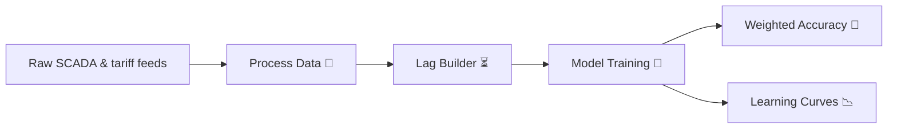

# ☀️ Elmy Predictive Solar Maintenance

<p align="center">
  
</p>

> Forecast solar farm health, anticipate price swings, and help O&M teams act before downtime hits. Swap in your own hero visual at `docs/media/hero-dashboard.png` to greet recruiters with a control-room snapshot or platform mock-up.

---

## ✨ Highlights
- 🔌 **Predictive maintenance ready:** engineered for solar inverter and tariff signals.
- 🧰 **Reusable toolkit:** dataclass-powered utilities for cleaning, lag features, scoring, and learning-curve inspection.
- 🧪 **Confidence built-in:** pytest coverage across preprocessing, feature engineering, metrics, and plotting.
- 📊 **Recruiter-friendly visuals:** ready-made hooks to showcase notebooks and CLI exports in interviews.

## 🗂 Repo Tour
```
.
├── src/utils/            # ETL, feature lags, scoring, plotting CLIs
├── tests/                # pytest suite validating the toolkit
├── notebooks/            # archived experiments & visual diagnostics
├── docs/media/           # drop presentation-ready images here
├── requirements.txt      # reproducible dependency set
└── README.md             # you are here 😊
```

## ⚙️ Quickstart
1. 🧪 Create an environment  
   `python -m venv env && source env/bin/activate`
2. 📦 Install dependencies  
   `pip install -r requirements.txt`
3. 📥 Fetch the [ENS Challenge Data – Elmy Electricity Price Forecast](https://challengedata.ens.fr/participants/challenges/140/) dataset → store raw files under `data/raw/`.
4. 🧼 Clean & scale  
   `python src/utils/process_data.py --input data/raw/elmy.csv --output data/interim/clean.csv --scaler standard`
5. ⏱ Build lags  
   `python src/utils/lag_data.py --input data/interim/clean.csv --target-column price_delta --n-lags 24 --output-features data/interim/lagged.csv --output-target data/interim/target.csv`
6. 📈 Inspect learning curves  
   `python src/utils/plot_learning_curves.py --model models/xgb.joblib --train data/interim/lagged_train.csv --validation data/interim/lagged_val.csv --target-column price_delta --save figures/learning_curve.png`
7. ✅ Run tests  
   `pytest`

## 🧠 Core Utilities
| Emoji | Module | What it delivers |
| --- | --- | --- |
| 🧽 | `process_data.py` | Drop columns/rows, impute, scale, and export via CLI |
| ⏳ | `lag_data.py` | Structured lag matrices with optional CLI batching |
| 🎯 | `weighted_accuracy.py` | Challenge-compliant weighted accuracy scorer |
| 📉 | `plot_learning_curves.py` | Publication-ready RMSE diagnostics (CLI + Matplotlib) |



<p align="center">
  
  <br/>
  <em>Drop a wind farm or field-ops image into <code>docs/media/windfarm-ops.png</code> to reinforce the renewable impact story.</em>
</p>

## 💬 Talking Points
- Emphasise proactive inverter swaps, spare-part staging, and tariff hedging enabled by accurate forecasts.
- Highlight notebooks like `analyse_models.ipynb` or `enrich_and_visualize_data.ipynb`; rename them with `YYYYMMDD_topic.ipynb` for a polished timeline.
- Mention that the CLI-driven toolkit can plug into live telemetry streams to power condition-based maintenance.
